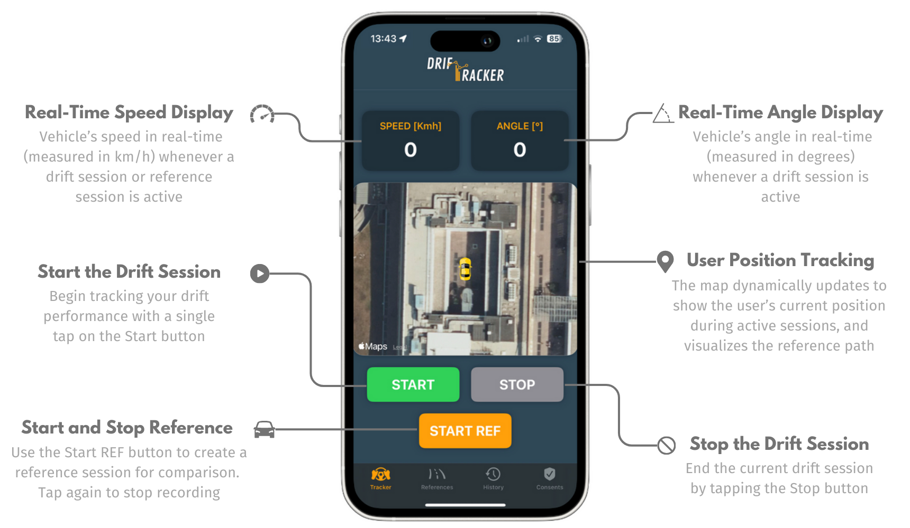
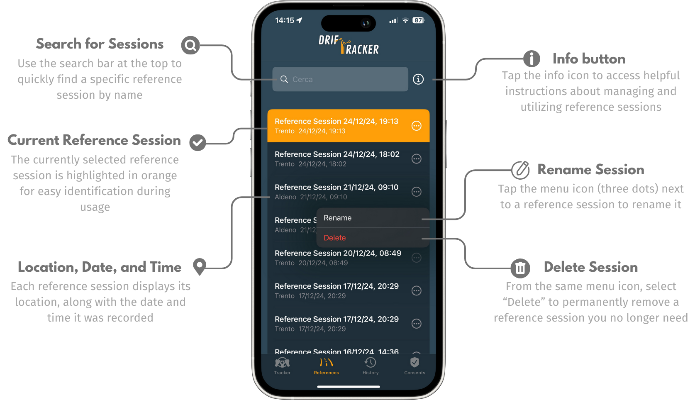
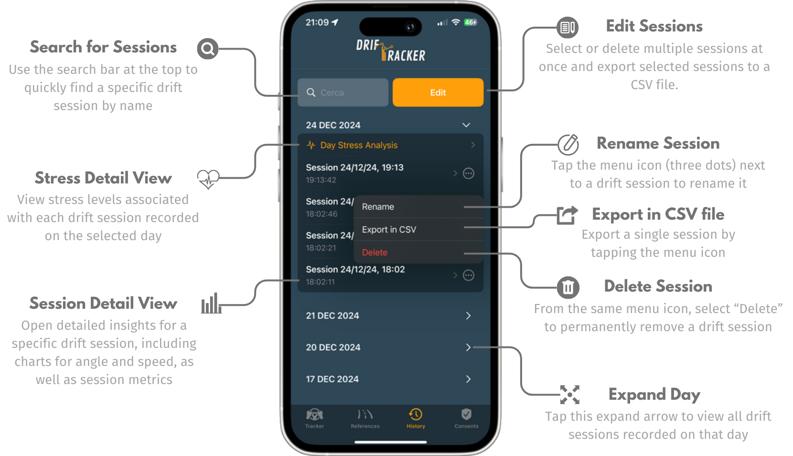
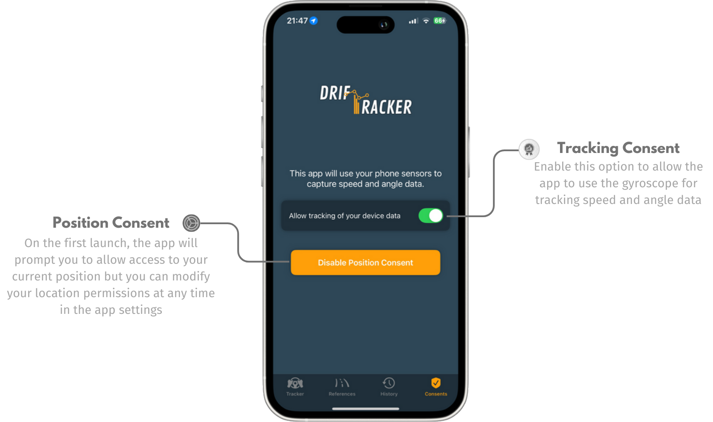

# DrifTracker
This README provides an overview of the ‘DrifTracker’ project, developed for the Sport Tech course during the 2024/2025 academic year at the University of Trento.

## Project Description
DrifTracker is an iOS application designed to help drivers improve their drifting performance during training sessions. It utilizes the phone’s sensors and biometric data (HRV) to provide real-time feedback on key metrics like drift angle, speed and it includes an analysis of the stress during an entire day of training.

## How to Use the Application

Below is a guide on how to use the application and explore its main features.

### **1. Tracker View**

The **Tracker View** is the main view and is used to start and monitor your drift sessions in real-time.



---

### **2. Reference View**

The **Reference View** allows you to manage your reference sessions.



---

### **3. History View**

The **History View** provides a detailed overview of all your drift sessions.



---

### **4. Consents View**

The **Consents View** allows you to manage app permissions.



## Project Structure
```
DrifTracker
├── Managers
│    ├── GeneralManager.swift         --> Handles general app management tasks
│    ├── HealthManager.swift          --> Fetches HRV data from the Health app
│    ├── KalmanFilter.swift           --> Processes sensor data to avoid drift error
│    └── MapManager.swift             --> Manages car annotation on the map
│
├── Views
│   ├── ConsentView.swift             --> Manages user consents for tracking
│   ├── HistoryView.swift             --> Displays all recorded drift sessions
│   ├── MainView.swift                --> Main entry point of the UI
│   ├── ReferenceListView.swift       --> Handles reference session management
│   ├── SessionDetailView.swift       --> Provides detailed session insights
│   ├── StressDetailView.swift        --> Displays stress analysis for a day
│   └── TrackerView.swift             --> Displays real-time drift metrics
│
├── Assets
│   └── Resources                     --> Contains images, icons, and other assets
│
├── DataController.swift              --> Handles Core Data operations
├── DriftTrackerApp.swift             --> Entry point of the application
└── DriftTrackerModel.swift           --> Defines data models for the app
```
## Installation and Run

To install and run the **DrifTracker** app, follow these steps:

1. **Prerequisites**:
   - The app is developed in **Swift** and requires **iOS 18** or higher.
   - Ensure you have a physical iOS device to run the project, as some features might not work on the simulator (GPS and gyroscope).
   
2. **Run**:
   - Clone the repository to your local machine:
     ```bash
     git clone https://github.com/SabriVinco/DrifTracker.git
     ```
   - Open the project in **Xcode** (version 15 or higher recommended).
   - Connect your physical iOS device to your machine.
   - Set your connected device as the target in Xcode.
   - Build and run the project by clicking the **Run** button in Xcode or using the shortcut `Cmd + R`.
   
3. **Permissions Required**:
    - Health Data: The app accesses Heart Rate Variability (HRV) data from the Health app to provide stress analysis.
    - Location Data: The app uses your current location for real-time tracking during drift sessions.

## Contributors

This project was developed by:

- **Erika Scaltrito** - [erika.scaltrito@studenti.unitn.it](mailto:erika.scaltrito@studenti.unitn.it)
- **Sabrina Vinco** - [sabrina.vinco@studenti.unitn.it](mailto:sabrina.vinco@studenti.unitn.it)

For more details about the project, check out the [Project Report](Report/DrifTracker_Report.pdf).


